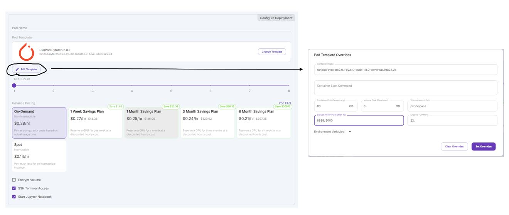
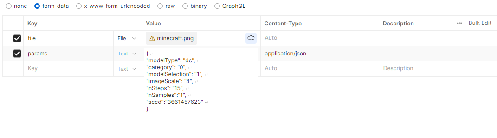

The package is done by OOTDiffusion team, please check them out. https://github.com/levihsu/OOTDiffusion

The package has been converted into flask restful API.

## Tech stack used
python3.10
bash
AWS S3

## Todo
1. Test the app ensure that the cloth is integrated properly. Maybe can use the seeds provided below, I have tested over 200 seeds and found that those two look great

## How to host it on runpod
1. Under Pods and clicking Deploy button on the top left, select RTX 2000 Ada
2. Choose any template but preferred RunPod Pytorch 2.0.1 or RunPod Desktop. 
3. Click edit template under Pod template and sure that Container Disk is 80GB and Volume Disk is 0 GB. Click Set Overrides afterwards. Ensure that 5000 is added to Expose HTTP Ports.

4. Click Deploy on-demand
5. Ensure that you have created private keys and public keys using rsa command. You can read more on here (https://docs.runpod.io/pods/configuration/use-ssh)

## Commands to run on runpod container
1. apt update -y && upgrade -y
2. apt install git-lfs -y
3. apt install nano -y
4. use access token to git clone this repo
5. cd BITBYTES_BACKEND/img2img
6. bash setup.sh
7. gunicorn --bind 0.0.0.0:5000 app:app

## How to use the API
1. Send a POST request to /generate endpoint
2. The request must be in multipart form-data
3. 
4. modelType. To select the AI model to detect and mask the body. hd:VITON-HD (upperbody only) and dc:Dress Code (upperbody, lowerbody and dress)
4. category. It is the type of clothing item you want to generate. 0: upperbody , 1: lowerbody, 2: dress
5. modelSelection. It is to select your model. The model are located in images/model. 1: images/model/model_1.png, 2: images/model/model_2.png
6. imageScale. The parameter allows you to scale the generated image. This can be useful if you need the output image to be of a specific size. The default value is 1.0, meaning no scaling. You can adjust this value to scale the image up or down as needed. Higher value means more computing.
7. nSteps. It determines the number of steps the model takes during the image generation process. More steps generally result in higher quality images but also increase the computation time. 
8. nSamples. It determines how many images it will generate. Best to keep it at 1 as it consumes alot of computation beyond 1.
9. seed. It initializes the random number generator for the image generation process. By setting a specific seed value, you can ensure that the generated images are reproducible. Recommended Seeds are 
10. The response will be an url to an image stored in S3 Bucket. You can view it in the browser from the url

## Useful Seeds to use
1. 3661457687
2. 3661457785

## What is in Routes folder
The routes can be found in routes/OOTDiffusionRoute.py . The generate route consists of validating the requests and then generate an output image using generateImage function from services/OOTDiffusionService.py

## What is in Services folder
The services can be found in services/*.py . Please ignore the run_ootd.py as it was the old way of running the package but it can be used as a reference as the services were built around it so that the package can be exposed as an api. OOTDiffusionService.py is where the magic happens while S3Service.py is responsible for putting the output image into the S3 bucket.

## What does the setup.sh do?
1. It will install the necessary python dependencies first
2. Next, it will change directory to utils/checkpoints folder
3. Then, git clone the models that the OOTDiffusion uses into the checkpoints folder
4. Finally, remove the unnecessary files in the checkpoints folder

## Important
1. Please do not use more than 1 for nSamples as the container may run out of memory. 
2. If the response returns an error, it is normally out of memory. Tweak the image scale or nSteps accordingly. The best parameters for those can be found in this [postman collections](./assets/img2img.postman_collection.json)

## Enviroment Variables to put in img2img folder
1. CHECKPOINT_PATH
2. AWS_ACCESS_KEY_ID
3. AWS_SECRET_ACCESS_KEY
4. S3_Bucket